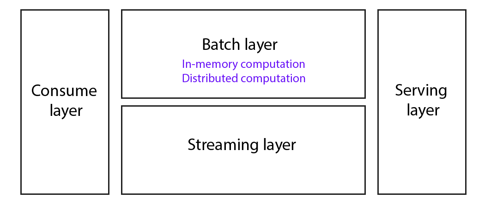
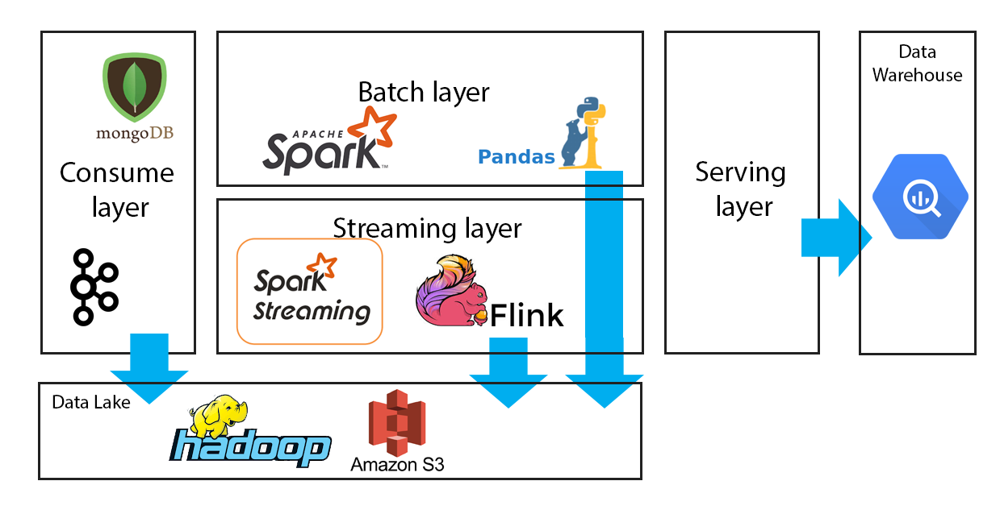

# Combine

#### Main idea:

Combine is a fast and scalable ETL. It can process data in two different mode based on the business needs:  
- Streaming mode : Process data and performs transformations in real time.
- Batch mode : Process data in batch mode. 

Combine enables users to build reusable and evolving pipelines thanks to its design.


#### Architecture:
Combine is based on Lambda architecture. We can see Combine as four layers as follows.

**Consume layer:** This layer is responsible for collecting data from different data sources 
such as API, Kafka cluster, etc.  

Beyond collecting data, we can check the quality of the data before start processing it. The quality checking means checking if the schema we receive is the same we expect, also, it can be checking the type of data.  
Or, we can count the number of lines of the data we received. All this metadata can be very useful if we want to monitor our pipelines and debug them easily.


**Batch layer:** This layer contains a data transformations in batch mode. It can be in two types :
- In-memory computation: We use in-memory library to process data. This very useful in case we have small data to process. 
- Distributed computation: We use a cluster of resources to process the data in parallel fashion. This will make the pipeline faster.  

We propose this two types because distributed computation (`Map Reduce framework`)  is slow in the case of small data. You can read more about the topic [here](https://databricks.com/blog/2018/05/03/benchmarking-apache-spark-on-a-single-node-machine.html) and [here](http://dorianbg.blogspot.com/2017/08/spark-vs-pandas-benchmark-why-you.html).

Batch layer contains a set of methods (data transformations) based on some business logic that ready to be used. We propose two type of methods: 
- Useful functions like read, write data from the external sources (`utils_distributed.py` or `utils_inmemory.py`) 
- Generic business functions such as checking if a `client_id` is an old client. This methods can be in two modes, the distributed one which is based on [Spark](https://spark.apache.org/), and the in-memory that is based on [Pandas](https://pandas.pydata.org/).

 
**Streaming layer:** This layer can transform data in real time and forward the result to the serving layer.


**Serving layer:** This layer forwards the data to a Data Warehouse or any other data store. 


**Pipeline:** We define a pipeline as a container that covers the `consume layer`, `batch layer` or `streaming layer` and `serving layer`. 

A pipeline can be either in-memory or distributed. Also, it's custom for each source.
In fact, each pipeline contains custom transformations for that data. 

We present an abstract model of the pipeline in `pipeline.py`


- `run()`: Execute the pipeline.
- `_connect()`: Fetch data from source and save it in the Data Lake. This method belongs to **consume layer**
- `_preprocess()`: Run some preprocessing tasks like checking the quality of data. This method belongs to **consume layer** as well.
- `_process()`: Contains some data transformations. It belongs to either **batch layer** or **streaming layer**.
- `_postprocess()`: Collecting some metadata about the pipeline which is useful for debug and monitoring. It belongs to either **batch layer** or **streaming layer**.
- `_save()`: Forward the result to data storage. This method belongs to **serving layer**

For each pipeline, we need to save a configuration in a database. This configuration can hold credentials to connect to API, sftp ,etc. 
Also, it can contain configuration of the some framework such as resource allocation is Spark. Moreover, we can keep useful indicator to track 
the last data we fetched from a certain source.

#### Technologies

In **consume layer**, we propose a MongoDB database to save configuration. This useful because we are not limited to a fixed schema and we can change it whenever we want without impacting other pipelines.

In **batch layer**, we propose Spark for distributed computation and Pandas for in-memory computation. 
In **streaming layer**, we can use Spark streaming or Flink. In fact, Spark streaming is batch streaming which is quite slow compared to Flink.
But Spark streaming offers a large set of transformations. 

Also, we need a **Data Lake** to store data collected by consume layer and to process it. We can use Spark, Yarn and Hadoop or Amazon EMR with S3. 



**Note:** This is just a proposition of technologies, but it can be different. 


#### Data flow
We define the data flow as follows: 
1. In **consume layer**, we download data from source and save it in the **Data Lake**, usually, as a table (Folder under HDFS or S3)
2. In **batch**/**streaming layer**, we process the saved data. If the data is too large (`Big Data`), we may need to save the final result in HDFS (or S3). 
3. In **serving layer**, if the final result still in memory, we forward it to a **Data Warehouse**. Otherwise, we read the final result from HDFS (or S3) and we inject it in the **Data Warehouse**.

### Example of NES
Example of `pipeline` that consumes data from Giantbomb API.

In order to build this ETL, we need to configure a custom `NesConnector` that extends `ApiConnector`

In `NesConnector`:
- `get_configuration()` is used to fetch configuration from the MongoDB. We make it static for instance.
- `sync()` is the method that synchronize data from the source. It hold a custom strategy that depends on the source. In our case, we filter data starting from `date_last_sync`. And then we query multiple times the API to cover all the data, since each response can hold only 100 records. 

In `NesGames` pipeline, we have :
- `_preprocess()`: It checks the number of lines. 
- `_process()` : We apply a set of transformations : normalize data, rename the dataFrame and drop null names.  
- `_save()` should inject data in the Data Warehouse

Some assumptions : 
- The folder `datalake` is our Data Lake that contains a table called `nes`. 
- The folder `datawarehouse` is our Data Warehouse where we supposed to save the data. 


After executing the NES pipeline, the result will be inside `\datawarehouse\res\output_timestamp.csv` 
 
 
Run the pipeline as follows :

```bash
# Download the project
$ git clone https://github.com/garawalid/Combine.git

# Run the pipeline
$ cd Combine/pipelines && python games_nes.py
```

### More topics : 

**Sync Strategies:**
- Track the data changes based on some attributes and check every x seconds, like we do in Giantbomb API.
- Consume data from Kafka cluster or any solution based on MQTT protocol.
- Use Webhook strategy to get notification from the source that new data arrives so we can start our pipeline.  

**Orchestration:**
- We can use Airflow or any similar solution to manage our pipelines.
 
**Possible improvements:**
- Add logging in the project
- Create unit test and integration test. An example of unit test is in `tests/layers/consume/test_api_connector.py`
- Add Travis CI and some DevOps solution.
- Add docstring to all methods. Example of docstring is in `_normalize_dataframe()` under `/pipelines/nes_games.py` 
- Package the project. This will make deployment faster and easier.
    